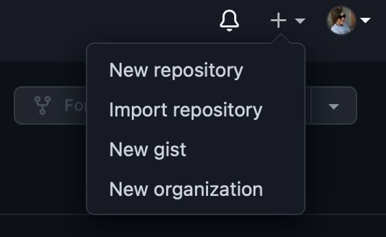
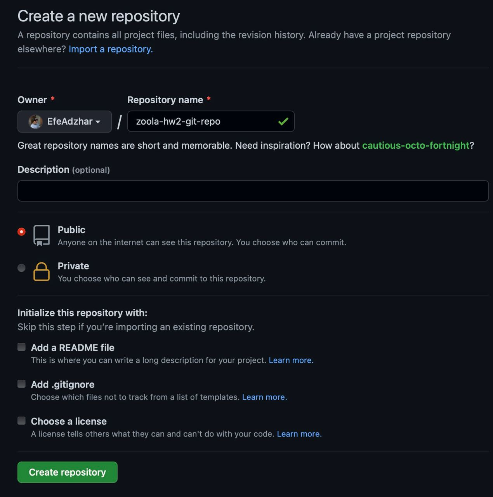
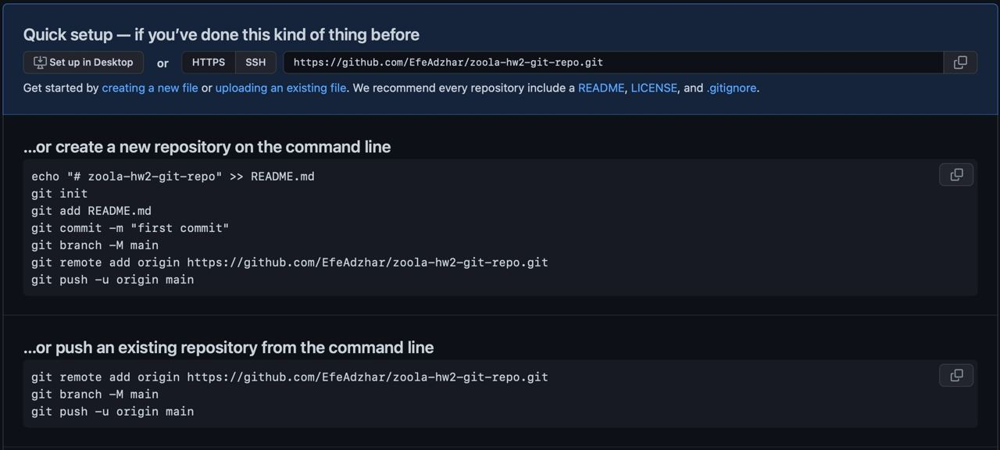
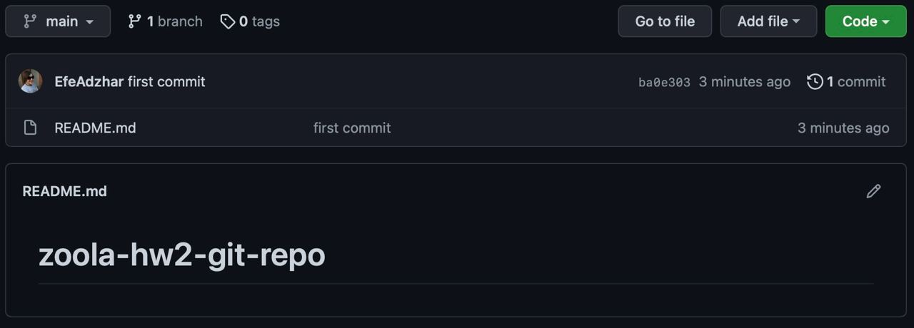

# Task 0: Setting up remote repo.

## Used git commands:
     1. git init
     2. git commit
     3. git status
     4. git checkout -b
     5. git branch
     6. git add .
     7. git push -u origin

## Step 1. Create new public repo in github.
To create new GitHub repo you need to click the `+` button that is far-right on a web page. If you can't find it, just look at screenshot `task-0-1` and you'll be fine. After clicking on the `+` button, you'll see a `Create a new repository` menu `task-0-2`. I named my repo `zoola-hw2-git-repo.git`. Not just because it's easy to understand why this repo was created, but it's also because I have no creativity :)
## Screenshots for Step 1:
### task-0-1:

### task-0-2:

## Step 2. Set it up both remote and local.
Jokes aside. We set up our first remote repository. Congrats for making it this far, there's no turning back now. If you chose to add `README` or `.gitignore` then you can easily clone it by using the `git clone <link>` command. To do that, you need to press the big green `Code` button on your repository main page. But if you don't know what the big green button looks like then screenshot `task-0-3` is right here to help you. 
But, if you're the same as me or if you're not looking for easy ways(as me), you need to set it locally and then push your commits to your remote repository.
It may sound pretty hard to do, but if you look closely to screenshot `task-0-4` you can see, that there's an instruction on how to quickly set up your repository. So...yeah, it's not hard at all. We just need to write down these commands step by step in our `Terminal` or whatever tool you're using. And after that, surprise, our, repository is set up locally. Great Job! You can see the fruits of your labor by reloading your repository's main page `task-0-5`. 
## Screenshots for Step 2.
### task-0-3

### task-0-4

### task-0-5

## Step 3. Create new branch.
Well, that's challenging. To do that, you need to type `git branch <name>`, and then to switch to that branch you need to type `git checkout <name>`. As I said, pretty challenging, same as understanding my sarcasm. 
But, you can make your life, even more, easier by combining two commands in one. Sounds great, doesn't it? To do so, just type `git checkout -b <name>`. This command creates a new branch and automatically switches you to that branch.  You can check that you are currently on your new branch with the `git branch` command `task-0-6`.
## Screenshots for Step 3.
### task-0-6

## Step 4. Create text file with your name and surname.
Just type `nano nameAndSurname.txt`. You can run nano in two ways. Nano will open the file if it exists. If it does not exist, it'll start a new buffer with that filename in that directory. 
P.S: You can also type `touch nameAndSurname.txt`. It will just create your file. You still need to press `nano` to open it. But if you use `nano` and then quit it without changing it, your file won't be saved.
After that, you will see an empty text editor. Just type your name and surname, press `control + X`, then press `Y` to confirm your changes, then press `Enter` to quit your text file and you're done.

## Step 5. Commit it.
By using `git status` you can see all `staged` and `unstaged` files.
To commit your changes, you firstly need to add them (great logic).
Use `git add .` to add all unstaged files and prepare them to be committed. Or use `git add <filename>` to add just the file you need.
After that type `git commit -m <message>`. Try to write your commits briefly but fully understandable, so it will describe what have you done. It will help you to not forget what were you doing two days ago. For example, my commit is `git commit -m "Added text file with name and surname"`. 

## Step 6. Push your branch.
To push your changes, use `git push -u origin <branch name>`.
Flag `-u` means it will set `upstream` to origin. In other words, it means to push the content from the local machine to the remote location.
Here is what the result should look like:

    efe@MBP-Efik zoola-hw2-git-repo.git %  git push -u origin task-0-hw2-git
    Enumerating objects: 4, done.
    Counting objects: 100% (4/4), done.
    Delta compression using up to 8 threads
    Compressing objects: 100% (2/2), done.
    Writing objects: 100% (3/3), 307 bytes | 307.00 KiB/s, done.
    Total 3 (delta 0), reused 0 (delta 0), pack-reused 0
    remote: 
    remote: Create a pull request for 'task-0-hw2-git' on GitHub by visiting:
    remote:      https://github.com/EfeAdzhar/zoola-hw2-git-repo/pull/new/task-0-hw2-git
    remote: 
    To https://github.com/EfeAdzhar/zoola-hw2-git-repo.git
     * [new branch]      task-0-hw2-git -> task-0-hw2-git
    Branch 'task-0-hw2-git' set up to track remote branch 'task-0-hw2-git' from 'origin'.
    efe@MBP-Efik zoola-hw2-git-repo.git %

## Step 7. Show the git logs.
To see your `logs` type `git log` command.

        efe@MBP-Efik zoola-hw2-git-repo.git % git log
        commit b24291b9a7b3c41db6d1fb47a57962795cd87a0d (HEAD -> task-0-hw2-git, origin/task-0-hw2-git)
            Author: EfeAdzhar <efeadzhar@gmail.com>
    Date:   Mon Feb 7 00:00:34 2022 +0200

            Added text file with name and surname

        commit ba0e3034fad2315a8593a6febd512ea8d478530d (origin/main, main)
    Author: EfeAdzhar <efeadzhar@gmail.com>
    Date:   Sun Feb 6 23:04:54 2022 +0200

        first commit

## Step 8. Attach a link to your repo in results.
#### No problemo : (https://github.com/EfeAdzhar/zoola-hw2-git-repo/tree/task-0-hw2-git)